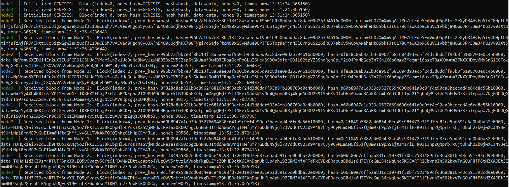
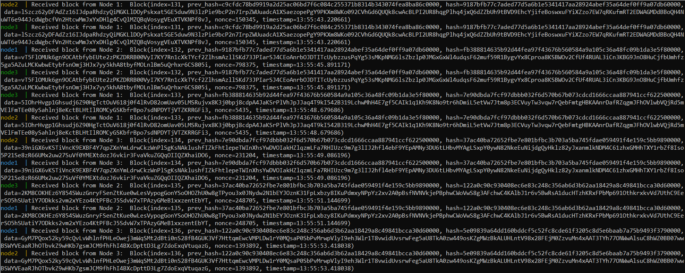
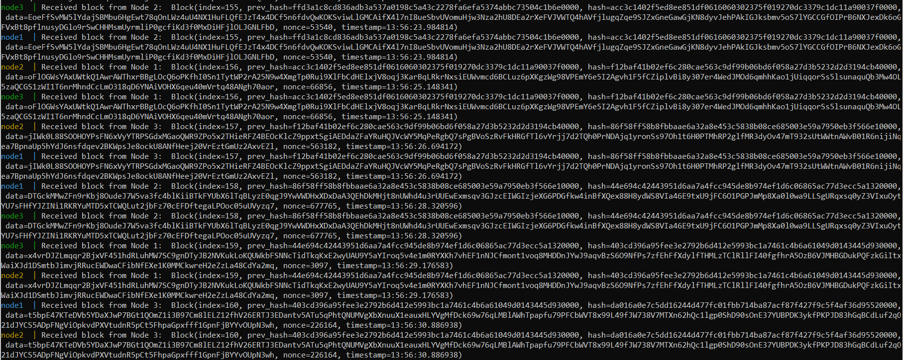

Ветка *main*: [](https://github.com/zina-frid/Blockchain/actions/workflows/blockchain_tests.yml)  

Ветка *develop*: [](https://github.com/zina-frid/Blockchain/actions/workflows/blockchain_tests.yml) 

---

## Описание
Блокчейн на языке Python с использованием фреймворка Flask.


### Класс Block:
Каждый блок состоит из следующих полей:
* `index` -- номер блока;
* `prev_hash` -- хеш предыдущего блока;
* `hash` -- хеш текущего блока (вычисляется путем конкатенации поля `index`, `prev_hash`, `data` и `nonce`, качестве хеш-функции используется sha256);
* `data` -- данные, в нашем случае строка длинной 256 случайных символов;
* `nonce` -- дополнение, позволяющее генерировать новый `hash` до достижения желаемой сложности (в нашем случае 4 нуля в конце);
* `timestamp` -- временная метка, присваиваемая блоку после генерации правильного `hash`.


### Класс Node:

Класс ноды. Хранит информацию о процессе, в котором была создана, хранит свою цепочку блоков, генерирует новые блоки, обрабатывает получаемые блоки.


### Класс Process:

Класс процесса. Реализует взаимодействие между нодами, отправление сгенерированных блоков соседним нодам и получение блоков от соседних нод. Genesis блок инициализирует первый процесс-нода и отправляет его соседям, затем ноды начинаю гонку по генерации блоков.


---

## Как запустить проект:

Клонировать репозиторий:
``` console
$ git clone https://github.com/zina-frid/Blockchain.git
```

Перейти в папку проекта:

``` console
$ cd Blockchain
```

Собрать образ:

``` console
$ docker build -t zina/blockchain:latest .
```

Запустить Docker Compose

``` console
$ docker-compose up
```

---

## Технические требования
Все необходимые пакеты перечислены в ```requirements.txt```

---

## Демонстрация работы

Демонстрация работы проекта с использованием ```docker-compose```:

*Инициализация genesis блока и начало работы*



*Генерация 131-136 блоков*




*Генерация 155-160 блоков*




---

## Тестирование

Реализованы следующие виды тестов.

*Модульные тесты:* 
* Конвертация блок в JSON-формат и обратно
* Генерация genesis блока
* Генерация данных
* Получение хэша по атрибутам блока
* Генерация правильного хэша
* Генерация цепочки блоков и её валидность

*Интеграционные тесты:*
* Получение блока/блоков от соседних узлов и обработка полученного блока
* Отправка сгенерированного блока соседним узлам
* Проверка работы трех узлов и идентичности их цепей в разные моменты времени

Реализован тестовый пайплайн Github Actions с запуском тестов на разных ОС: Linux, Windows, MacOS.


